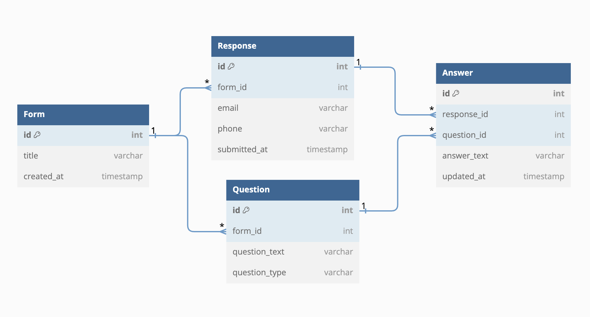
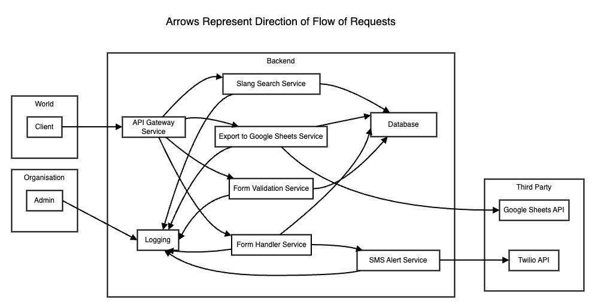

# Backend Task Atlan

- A microservices based approach for the backend challenge given. 
- All services written in Flask, and containerised separately with Docker.
- Postgresql used for database

## Important:

- To Start all services run:

```
docker-compose up --build
```

- Api endpoints documentation can be found in [http://127.0.0.1:5000/swagger](http://127.0.0.1:5000/swagger) and [API_ENDPOINTS.md](API_ENDPOINTS.md).
- Details about logging service can be found in [http://127.0.0.1:5005/swagger](http://127.0.0.1:5005/swagger) and [LOGGER.md](LOGGER.md).
- If Database data can't be accessed inside [Database_Data](Database_Data) folder, it is likely due to a folder permission issue which can be solved using:
```
sudo chmod -R a+rwx,go-w ./Database_Data
```
- Similar issue may come for App logs, so run this: 
```
sudo chmod -R a+rwx,go-w ./Log_Service/logs/app.log
```
- I have included all the **env variables** like google service account creds, twilio account creds for the sake of testing out. Will be deleting them in their respective dashboards in 2 weeks.

## Data Design:



## System Architecture



## My Approach to solving this project:

**The project has been done in Microservices Architecture.**

### Why I used this architecture:
- **Modularity** was required, so all post submission business logic has been separated.
- **Plug and Play** nature was required, separation into microservices ensures easy addition of new services or removal of one.
- All these **services can be separately hosted** anywhere, only modification required would be the services_url environment file and docker-compose file.
- **Fault tolerance** is ensured as issues in one service don't necessarily affect the others as they run on independent containers.
- A **unified interface** [API Gateway](API_Gateway) acts as a middleman which serves all the requests.<br/> This service can be **Replicated** if required for better load balancing of a large number of requests. Any other service can also be replicated in a similar way for better horizontal scaling on a need basis.
- Since each service is independent, service outages of one don't affect the functioning of the application, and simply hosting the a copy of the service elsewhere without outage can bring the service back up without any modification needed elsewhere.
- Each service can be **written in any language or framework**.

### Some drawbacks of the approach:
- Complex development of services, as each service is a separate container.
- More deployment cost in comparison, as each service is a docker container with isolated dependencies. Just running locally I was able to see disk usage accumulating over time which was much much larger than what would be for a non-microservices non-containerised architecture.
- More latency if services are hosted distant. Can be improved via various load balancing and scaling techniques.

```
But in the long run, the microservices architecture would be more cost effective, maintainable and scalable for this problem.
```

### Other approaches that could've been considered:
#### Monolithic Architecture:
This is how I used to design for any simple applications like personal projects, hackathons, etc.<br/><br/>
**Pros:**
- **Simple** to design and develop at speed. Especially nice for situations like hackathons were scalability didn't matter much.
- **Cost efficient**, my personal projects can be easily hosted on free tiers of several platforms. 
<br/>

**Cons:**

- **Hard to scale** to several users.
- **Dependencies** of different services can intervene with each other.
- More **probability of system outage** when one service goes down.
- **Plug and Play** nature is not as straightforward as microservices to implement.

#### Event-Driven Architecture
- This can be coupled with Microservices if needed. 
- I didn't consider this approach as our system is more towards responding to client requests and serving data, rather than something with a lot of internal events, like for eg, a trading platform that listens to real-time data a lot.
- In this approach multiple services can respond to same event, such as Uber app calculating prices, showing prices, and sending request to driver at the same time as user ride request.
- But Unnecessary overhead of event handlers, and event queues can be avoided when not needed, and hence this doesn't feel required for our problem.


## Some Credits
- Bing Chat
- Twilio API for sms alerts